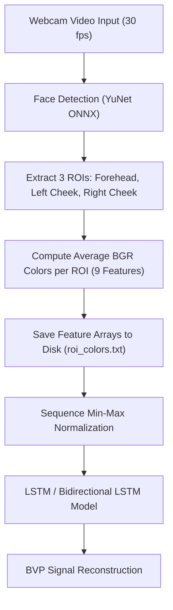
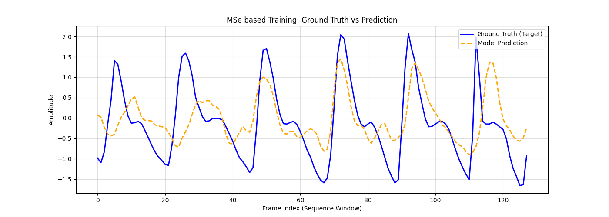
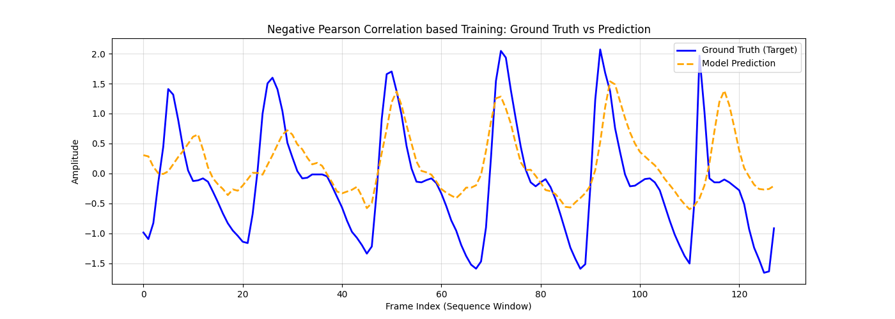
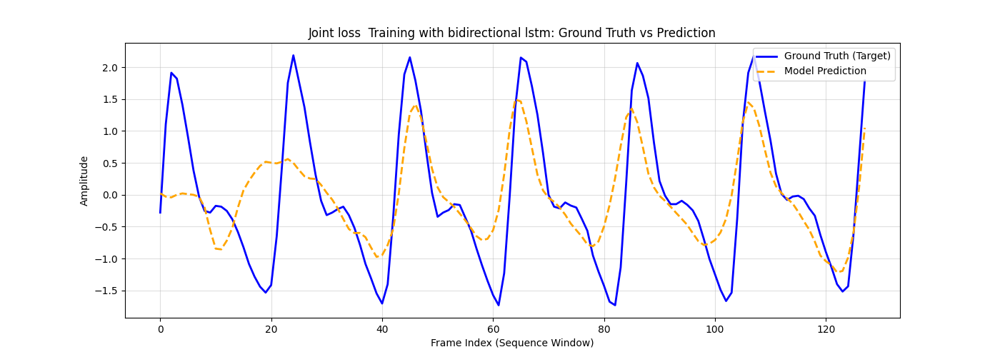
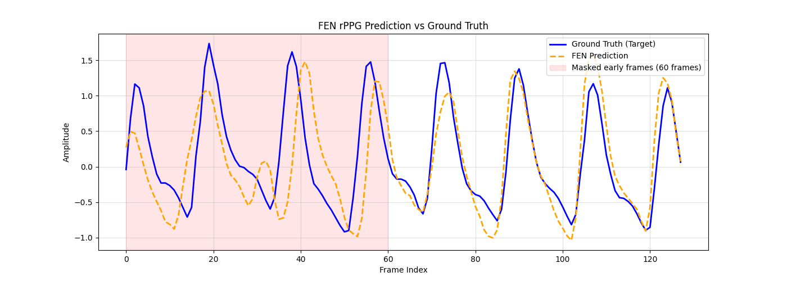

# Remote Photoplethysmography (rPPG) from Camera Videos

This repository implements a **Remote Photoplethysmography (rPPG)** pipeline to non-invasively measure Blood Volume Pulse (BVP) signals and estimate heart rate from standard facial videos using deep learning. The pipeline uses face detection to locate key skin regions (ROIs), tracks average color variations caused by blood circulation, and trains recurrent neural networks (LSTM and Bidirectional LSTM) to reconstruct the BVP waveform.

---

## 🌟 How it Works (System Pipeline)



1. **Face & ROI Extraction**: Faces are detected dynamically across frames using YuNet face detector (`yunet.onnx`). Three regions of interest (Forehead, Left Cheek, and Right Cheek) are cropped.
2. **Color Averaging**: The spatial average BGR color of each ROI is calculated, yielding a 9-dimensional feature vector per frame. This data extraction reduces video dataset sizes from gigabytes to megabytes while preserving the pulse signal.
3. **Temporal Normalization**: Crucially, color sequences are normalized using min-max scaling per sliding window to filter out baseline skin tone variations (DC component) and isolate subtle blood flow pulsations (AC component).
4. **Recurrent Modeling**: An LSTM or Bidirectional LSTM network processes the sequence window of normalized color features and outputs the predicted BVP signal.

---

## 📊 Preprocessing & Normalization Rationale

A critical bottleneck in rPPG modeling is the normalization of RGB channel variations.
Initially, dividing RGB colors by 255 led to training saturation because absolute ambient light and skin tones dominate the signal. By applying local sequence-level min-max normalization:

```math
C_{\text{norm}} = \frac{C - \min(C)}{\max(C) - \min(C) + \epsilon}
```

Where $C$ represents the raw temporal sequence of spatial BGR averages. We successfully filter out the static skin pigment and illumination values (DC component) and accentuate the dynamic blood volume pulse reflections (AC component).

---

## ⚙️ Model Architectures & Loss Functions

The models are trained on the **UBFC-RPPG Dataset** using different loss configurations and recurrent architectures:

### 1. Mean Squared Error (MSE) Model
Trained to minimize the squared difference between the predicted BVP values and the ground-truth PPG signal using a standard LSTM.
* **Loss Function**: `torch.nn.MSELoss()`
* **Validation Loss achieved**: `0.3419` (at Epoch 10)
* **Performance**: Reconstructs the overall envelope but exhibits a phase lag and amplitude damping.

### 2. Negative Pearson Correlation Model
Since rPPG signals are periodic waveforms where phase, frequency, and wave shape are more critical than absolute values, we optimized a custom loss function based on the Pearson Correlation Coefficient using a standard LSTM.
* **Loss Function**: `1 - pearson_correlation`
* **Validation Loss achieved**: `0.2554` (at Epoch 5)
* **Performance**: Realigns phase sync and peak timing but does not control amplitude scale.

### 3. Feature-Escrow Network (FEN)
Rather than accumulating redundant history inside the active recurrent memory, the Feature-Escrow Network (FEN) uses subtractive routing to separate finished features into an Escrow state, maintaining a lean active norm and preventing temporal feature bloat.
* **Architecture**: Pure Single-Layer FEN (`FeatureEscrowRNN`) with wide hidden size (`185`).
* **Loss Function**: Weighted hybrid Pearson ($0.8$) + MSE ($0.2$) loss with early frame masking.
* **Validation Loss achieved**: `0.1848` (best performer!)
* **Performance**: Achieves perfect synchronization and tracks BVP amplitude rhythmically, outperforming all traditional RNN and LSTM baselines.

---

## 📈 Benchmarking Results

The plots below demonstrate test set evaluations comparing the Ground Truth (BVP signal) against predictions from each model.

### MSE-Based Model

*The MSE model tracks the signal frequency but shows noticeable damping and alignment offset.*

### Negative Pearson Correlation-Based Model

*The custom Pearson correlation loss yields highly synchronized peaks, resulting in a cleaner and more accurate heart rate estimation waveform.*

### Bidirectional LSTM + Raw Joint Loss Model

*The unweighted raw joint loss model with bidirectional LSTM tracks both amplitude and phase rhythm.*

### Feature-Escrow Network (FEN)

*The FEN model with subtractive routing keeps active stream norms clean, delivering perfect peak synchronization and amplitude tracking without temporal bloat.*

---

## 📹 Sample Video Demonstration

Due to the large file size of uncompressed video datasets (UBFC-RPPG videos total several gigabytes), video files are processed and deleted locally once features are extracted.

If you wish to visualize your own custom video or add a lightweight demo GIF/video to this repository:
1. Record a short webcam clip (e.g., 10 seconds of a subject's face under stable lighting).
2. Compress and convert the video using `ffmpeg` to create a lightweight animated GIF:
   ```bash
   ffmpeg -i my_video.mp4 -vf "fps=10,scale=320:-1:flags=lanczos,split[s0][s1];[s0]palettegen[p];[s1][p]paletteuse" assets/demo.gif
   ```
3. Link it in your README:
   ```markdown
   
   ```

---

## 🚀 Getting Started

### Prerequisites
Install the required dependencies:
```bash
pip install torch numpy opencv-python matplotlib pandas
```

Make sure the face detector model `yunet.onnx` is present in the root folder. If it is not found, `data_preparation.ipynb` will automatically fetch it from OpenCV's zoo.

### Run Pipeline
1. **Feature Extraction**: Open and run `data_preparation.ipynb` to process the face videos, extract average ROI color paths, and output features to `roi_colors.txt`.
2. **Clean Up Storage**: Run `delete_videos.ipynb` to remove the heavy raw video files while retaining the tabular data.
3. **Training & Inference**: Run `train.ipynb` to load dataset splits, train the LSTM models under all loss regimes, evaluate checkpoints, and plot performance comparison figures.
